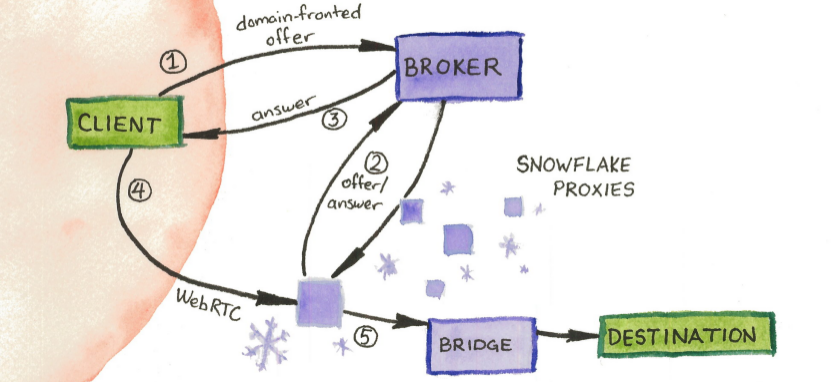

# Snowflake

Snowflake is a censorship-evasion pluggable transport using WebRTC, inspired by Flashproxy.

### Custom fork

This fork differs from upstream Snowflake in the following ways:

- Requires Go 1.26 or later, with updated dependencies.
- Uses a custom transport for broker negotiation: TLS 1.3 with a selected set of cipher suites and groups, over MultiPath TCP.
- Ships a custom DTLS fingerprint, different from any popular WebRTC implementation.
- Uses pion's Setting Engine to reduce MulticastDNS noise.
- Uses a context-aware `io.Reader` in `copyLoop` that closes on errors.
- Keeps token handling extremely simple.
- Pads client traffic to evade TLS-in-DTLS detection.
- Adds a proxy option to force the NAT type to unrestricted.
- Uses `coder/websocket` in place of `gorilla/websocket`.

**Table of Contents**

- [Custom fork](#custom-fork)
- [Structure of this Repository](#structure-of-this-repository)
- [Usage](#usage)
  - [Using Snowflake with Tor](#using-snowflake-with-tor)
  - [Running a Snowflake Proxy](#running-a-snowflake-proxy)
  - [Using the Snowflake Library with Other Applications](#using-the-snowflake-library-with-other-applications)
- [uTLS settings](#utls-settings)
- [Development](#development)
- [FAQ](#faq)
- [More info and links](#more-info-and-links)

### Structure of this Repository

- `broker/` contains code for the Snowflake broker
- `client/` contains the Tor pluggable transport client and client library code
- `common/` contains generic libraries used by multiple pieces of Snowflake
- `distinctcounter/` contains the cardinality counting used for broker metrics
- `docs/` contains Snowflake documentation and manpages
- `dtls/` contains the forked DTLS stack carrying this fork's custom handshake fingerprint
- `probetest/` contains code for a NAT probetesting service
- `proxy/` contains code for the Go standalone Snowflake proxy
- `server/` contains the Tor pluggable transport server and server library code

### Usage

Snowflake is currently deployed as a pluggable transport for Tor.

#### Using Snowflake with Tor

To use the Snowflake client with Tor, you will need to add the appropriate `Bridge` and `ClientTransportPlugin` lines to your [torrc](https://2019.www.torproject.org/docs/tor-manual.html.en) file. See the [client README](docs/client.md) for more information on building and running the Snowflake client.

#### Running a Snowflake Proxy

You can contribute to Snowflake by running a Snowflake proxy. We have the option to run a proxy in your browser or as a standalone Go program. See our [community documentation](https://community.torproject.org/relay/setup/snowflake/) for more details. 

#### Using the Snowflake Library with Other Applications

Snowflake can be used as a Go API, and adheres to the [v2.1 pluggable transports specification](https://github.com/Pluggable-Transports/Pluggable-Transports-spec/blob/master/releases/PTSpecV2.1/Pluggable%20Transport%20Specification%20v2.1%20-%20Go%20Transport%20API.pdf). For more information on using the Snowflake Go library, see the [Snowflake library documentation](docs/using-the-snowflake-library.md).

### uTLS settings

The client reaches the broker, which acts as the signaling server, over a domain-fronted TLS connection. Without further configuration, that connection is identifiable by the ClientHello fingerprint of the Go TLS stack.

uTLS is a library that imitates the ClientHello fingerprint of browsers and other widely deployed TLS stacks, so that a censor cannot single out Snowflake traffic by its fingerprint alone. Select a fingerprint to imitate with `-utls-imitate`, and run the client with `-version` to list the supported values.

Not every fingerprint works against every server: some extensions are not fully implemented, so the result depends on both the client and the server configuration.

You can also drop the SNI (Server Name Indication) extension from the ClientHello with `-utls-nosni`. Not all servers accept connections without it.

### Development

Build with `go build -v ./...` and test with `CGO_ENABLED=1 go test -race ./...`. See the
[development documentation](docs/development.md) for the repository layout, the lint and
commit conventions, and the invariants (privacy, fingerprinting resistance, wire
compatibility) that changes must preserve.

### FAQ

**Q: How does it work?**

In the Tor use-case:

1. Volunteers visit websites that host the 'snowflake' proxy, run a snowflake [web extension](https://gitlab.torproject.org/tpo/anti-censorship/pluggable-transports/snowflake-webext), or use a standalone proxy.
2. Tor clients automatically find available proxies through the broker, the domain-fronted signaling channel.
3. The Tor client and the proxy establish a WebRTC peer connection.
4. The proxy connects to a relay.
5. The client bootstraps Tor over that connection.

For how clients, proxies, the broker and the server fit together, see the
[broker](docs/broker.md), [client](docs/client.md), [proxy](docs/proxy.md) and
[server](docs/server.md) documentation.

**Q: What are the benefits of this PT compared with other PTs?**

Snowflake combines the advantages of flashproxy and meek. Primarily:

- It has the convenience of Meek, but can support magnitudes more
users with negligible CDN costs. (Domain fronting is only used for brief
signalling / NAT-piercing to setup the P2P WebRTC DataChannels which handle
the actual traffic.)

- Arbitrarily high numbers of volunteer proxies are possible like in
flashproxy, but NATs are no longer a usability barrier - no need for
manual port forwarding!

**Q: Why is this called Snowflake?**

It utilizes the "ICE" negotiation via WebRTC, and also involves a great
abundance of ephemeral and short-lived (and special!) volunteer proxies...

### More info and links

We have more documentation in the [Snowflake wiki](https://gitlab.torproject.org/tpo/anti-censorship/pluggable-transports/snowflake/-/wikis/home) and at https://snowflake.torproject.org/.
